# rancher-kuberlr
A simple way to invoke the correct [kubectl](https://github.com/rancher/kubectl) version on a Rancher managed cluster using [kuberlr](https://github.com/flavio/kuberlr).

## Artifacts of this repo
This repo produces:
- Base generic kuberlr images `mallardduck/rancher-kuberlr:base-{version}` (matching [kuberlr](https://github.com/flavio/kuberlr) versions 1:1),
  - This is simply a container with `kuberlr` binary in it.
- Rancher specific kuberlr `mallardduck/rancher-kuberlr:{version}`.
  - This container is analogous to the current `rancher/kubectl` container, but based on [kuberlr](https://github.com/flavio/kuberlr)
  - Unlike `rancher/kubectl` the kubler image targets specific Rancher minor release.
  - Each release pre-bundles all [kubectl](https://github.com/rancher/kubectl) versions supported by the Rancher version the release supports.

## Branches, Releases, and Rancher
| branch           | Release | Rancher |
|------------------|---------|---------|
| (default branch) |base-v0.Y.Z|n/a|
| release/v2.9     |v2.Y.Z|2.9.Z|
| release/v2.8     |v1.Y.Z|2.8.Z|

### Notes:
- The workflows for the base images of kuberlr have to live in the `default branch`, over time this changes (currently `release/v2.9`).
- It could go live upstream in the [kuberlr](https://github.com/flavio/kuberlr) repo - but this is easy enough to do.
- Each minor Rancher release will get a kubler image tag major to match it.
  - This gives us full "Y" and "Z" control on versioning the component to target Rancher minors.
  - E.x. Rancher 2.8.x releases will get varying versions of 1.Y.Z

### Compatability

```mermaid

gantt
    title kuberlr-base image vs kuberlr iamge
    todayMarker off
    dateFormat X
    axisFormat %S
    tickInterval 1second
    section kuberlr image
        1.Y.Z           :25,28
        2.Y.Z           :27,30
    section kuberlr-base image
        base-v0.4.5     :25,30
```

```mermaid

gantt
    title `rancher/rancher` and `rancher-kuberlr`
    todayMarker off
    dateFormat X
    axisFormat %S
    tickInterval 1second
    section Rancher
        2.8.X           :25,28
        2.9.X           :27,30
    section kuberlr image
        1.Y.Z (for Rancher 2.8)   :25,28
        2.Y.Z (for Rancher 2.9)   :27,30
    section Kubectl
        1.25              :24,26
        1.26              :25,27
        1.27              :26,28
        1.28              :27,29
        1.29              :28,30
        1.30              :29,31
```

Note: Over-time, as new `kuberlr` binaries are released we can introduce a new base image based on that.  
Then we can still subsequently bump the Y or Z of that "rancher kuberlr" release to update all supported Rancher releases.

